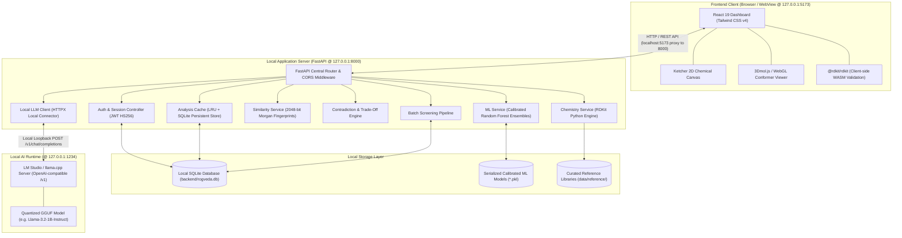

# ROGVEDA

> **In-Silico Molecular Intelligence & Drug Discovery Screening Platform**  
> *One molecule. One workspace. One reproducible research loop.*

[](LICENSE)
[](https://www.python.org/)
[](https://fastapi.tiangolo.com/)
[](https://react.dev/)
[](https://vitejs.dev/)
[](https://www.rdkit.org/)
[](backend/tests/)

---

## 1. Project Overview

**ROGVEDA** is an offline-first, privacy-preserving computational chemistry and early-stage drug discovery workbench.

### The Problem It Solves
Early-stage medicinal chemistry and drug discovery workflows are heavily fragmented. Researchers, students, and small academic laboratories frequently juggle disconnected utilities:
- Standalone drawing apps for 2D chemical sketching.
- Cloud web servers for calculating molecular descriptors.
- Cloud APIs for bioactivity and toxicity estimations.
- External databases for similarity matching.
- Manual spreadsheets and notes for tracking structural modifications.

This fragmentation creates severe context switching, eliminates reproducibility, and forces researchers to upload proprietary or unpublished molecular structures to third-party cloud servers.

### Why ROGVEDA Exists
ROGVEDA unifies the complete molecular exploration cycle into a **single, local-first desktop application**:
$$\text{Input (Draw / SMILES)} \longrightarrow \text{Compute Descriptors} \longrightarrow \text{Predict Multi-Endpoint Activity} \longrightarrow \text{Similarity Search} \longrightarrow \text{Optimize \& Mutate} \longrightarrow \text{Track \& Export}$$

### What Makes It Different
1. **Local-First & Offline**: Operates completely on `127.0.0.1` without outbound runtime network calls. No user molecules, proprietary structures, or experiment notes leave the local machine.
2. **Deterministic Cheminformatics**: Powered by native C++ **RDKit** binaries running locally via Python and WebAssembly in the browser.
3. **Calibrated Machine Learning**: Uses scikit-learn models trained on 230,000+ compounds from **ChEMBL 37** and **Tox21**, evaluated strictly using **80/20 Bemis-Murcko Scaffold Splits** and calibrated via `CalibratedClassifierCV` for well-calibrated confidence probabilities.
4. **Locally Grounded AI Insights (RAG)**: Connects to local LLM engines (e.g., LM Studio or `llama.cpp` running models like `llama-3.2-1b-instruct` or `Qwen2.5-0.5B`) to synthesize structured chemical facts, flag structural contradictions, and explain property trade-offs without cloud dependencies.

---

## 2. Key Features

### Core Cheminformatics
- **Deterministic Descriptor Calculation**: Computes 17+ core physical and topological properties in real-time using RDKit:
  - Molecular Formula, Molecular Weight (MW), Exact Mass.
  - Lipophilicity & Polarity: Crippen LogP, Topological Polar Surface Area (TPSA), Molar Refractivity.
  - Bioavailability / Lipinski Rules: Hydrogen Bond Donors (HBD), Hydrogen Bond Acceptors (HBA), Rotatable Bonds, Lipinski Rule-of-5 Violations.
  - Geometry & Composition: Aromatic Rings, Saturated Rings, Total Rings, Heavy Atoms, Heteroatoms, Fraction Csp³ (carbon saturation), Chiral Centers, Amide Bonds.
- **Synthesizability Assessment**: Computes fragment-based Synthetic Accessibility Scores (SA_Score 1–10) and flags reactive functional groups (e.g., acyl halides, Michael acceptors, aldehydes).

### Interactive 2D & 3D Visualization
- **Embedded Ketcher 2D Sketcher**: Full chemical canvas supporting atom/bond drawing, template libraries, ring insertions, SMILES/Molfile import and export, with automatic structure sanitization.
- **Interactive 3D Conformer Viewer**: Real-time 3D coordinate embedding using the Distance Geometry algorithm (ETKDGv3) rendered directly in WebGL via `3Dmol.js` and Three.js scenes.

### Calibrated Machine Learning Predictions
- **Multi-Endpoint Classification**: Instant parallel inference across 6 critical safety and efficacy targets:
  - **hERG Cardiotoxicity** (KCNH2 channel inhibition / QT prolongation risk).
  - **Tox21_MMP** (Mitochondrial Membrane Potential disruption).
  - **Anti-microbial Activity**.
  - **Anti-cancer Activity**.
  - **Anti-inflammatory Activity**.
  - **Anti-oxidant Potential**.
- **Probability Calibration**: Every prediction ships with a calibrated confidence bar derived from `CalibratedClassifierCV(method='sigmoid')`, explicitly communicating probability distance from the decision boundary.

### Virtual Screening & Exploration
- **Tanimoto Similarity Search**: 2048-bit Morgan Fingerprint (radius=2) nearest-neighbor searches against curated reference libraries to discover structurally related bioactives.
- **Chemical Space Projection**: 2D projection mapping novel compounds into known chemical space.
- **High-Throughput Batch Screening**: Process multi-molecule CSV or SDF files in parallel with automated property filters and exportable screening summaries.

### Local AI Copilot & Contradiction Detection
- **Trade-Off & Contradiction Detection**: Rule-based heuristic engine flags biochemical paradoxes (e.g., high predicted anti-inflammatory activity coupled with unacceptable hERG cardiotoxicity or poor oral bioavailability).
- **Offline RAG Summaries**: Formulates strict prompt templates containing computed facts, detected trade-offs, and synthesis flags for local LLM text generation.

### Experiment Management & Reporting
- **Versioned Experiment History**: Tracks parent-child molecular modification chains in a local SQLite database.
- **Document & Report Generation**: Generates comprehensive, self-contained HTML/PDF reports detailing 2D structure, 3D coordinates, computed properties, ML predictions, and AI notes.

---

## 3. System Architecture



### Component Breakdown
- **Frontend**: Single-page application built with React 19, Vite, and Tailwind CSS. Employs `@rdkit/rdkit` (WebAssembly) for instantaneous client-side SMILES validation and canonicalization. Ketcher handles 2D molecular drawing inside an iframe container, while `3Dmol.js` renders ETKDG-embedded 3D coordinates.
- **Backend**: Python 3.12 FastAPI service strictly bound to loopback `127.0.0.1`. Contains modular service domains for RDKit descriptor calculation, scikit-learn model inference, Tanimoto similarity searching, batch screening, and SQLite persistence.
- **Database**: Local SQLite instance (`backend/rogveda.db`) storing user credentials (salted password hashes), experiment history, saved reports, and analysis cache entries.
- **Machine Learning Layer**: Joblib-serialized ensemble models combining 2048-bit Morgan Fingerprints with calibrated probability sigmoid curves. Preloaded asynchronously into memory at server startup.
- **LLM Layer**: Decoupled HTTP interface connecting via loopback to an OpenAI-compatible local runtime (LM Studio or `llama.cpp`). Operates strictly as a text-in/text-out summarizer with structured RAG prompt templates.

---

## 4. Architecture Dataflow

The standard lifecycle for analyzing a molecule proceeds through 7 discrete stages:

```text
User Action (Draw structure / Enter SMILES)
  │
  ▼
[1] Client-side Validation (@rdkit/rdkit WASM)
  │ (Instant syntax verification; canonicalizes SMILES; rejects invalid valence)
  ▼
[2] HTTP POST Request -> /api/molecule/analyze or /api/molecule/predict-all
  │
  ▼
[3] Backend Chemistry Engine (RDKit Python)
  ├── Parses Mol from SMILES with sanitization
  ├── Generates 3D conformer coordinates via ETKDGv3 algorithm
  └── Calculates 17+ physicochemical properties (MW, LogP, TPSA, HBD, HBA)
  │
  ▼
[4] Parallel ML Inference Engine (Scikit-Learn)
  ├── Featurizes molecule into 2048-bit Morgan Fingerprint (radius=2)
  ├── Queries calibrated Random Forest models (hERG, Tox21, Antimicrobial, etc.)
  └── Computes calibrated confidence probabilities
  │
  ▼
[5] Biochemical Trade-off & Synthesis Evaluation
  ├── Evaluates rule-based contradictions (e.g. Activity vs. Toxicity)
  └── Computes Ertl-Schuffenhauer Synthetic Accessibility (SA_Score)
  │
  ▼
[6] Local LLM Context Injection (RAG)
  ├── Constructs structured factual prompt (Properties + Predictions + Contradictions)
  └── Queries local LLM engine (127.0.0.1:1234/v1) with 10s strict timeout
  │
  ▼
[7] Unified JSON Response -> Frontend UI Rendering
  └── Synchronously updates 2D view, 3D WebGL viewer, Property cards, ML bars, and AI notes
```

---

## 5. Technology Stack

| Layer | Technology | Version / Specification | Purpose |
| :--- | :--- | :--- | :--- |
| **Frontend Framework** | React | 19.1.0 | Component-based reactive user interface |
| **Frontend Tooling** | Vite | 6.x | Fast development server and module bundler |
| **Frontend Styling** | Tailwind CSS | 4.x (`@tailwindcss/vite`) | Responsive, custom dark-mode theme |
| **In-Browser Chemistry** | `@rdkit/rdkit` | 2026.3.6 (WASM) | Client-side validation, canonicalization, and live feedback |
| **2D Chemical Editor** | Ketcher Core & React | 3.14.0 | Professional 2D chemical structure drawing |
| **3D Molecular Viewer** | 3Dmol.js / Three.js | 2.5.5 / 10.7.8 | WebGL 3D conformer rendering and orbital animations |
| **Charts & Metrics** | Recharts | 3.10.1 | Radar plots and property comparison charts |
| **Backend Framework** | FastAPI | 0.115+ | High-performance asynchronous REST API |
| **ASGI Server** | Uvicorn | Standard | Asynchronous web server bound to `127.0.0.1` |
| **Cheminformatics Engine**| RDKit (Python) | 2024.03+ | Descriptors, fingerprints, 3D embedding, and SMARTS matching |
| **Machine Learning** | Scikit-Learn | 1.6+ | Random Forest classifiers and CalibratedClassifierCV |
| **Model Serialization** | Joblib | 1.4+ | Fast loading and caching of trained ML pipelines |
| **Local Database** | SQLite / SQLAlchemy | 2.0+ (Async engine) | Local relational storage for experiments, users, and cache |
| **Authentication** | PyJWT / Passlib | HS256 / Bcrypt | Local user authentication and secure password hashing |
| **Local LLM Runtime** | LM Studio / llama.cpp | OpenAI API compatible | Local loopback inference for quantized GGUF models |
| **HTTP Client** | HTTPX | 0.28+ | High-speed async client for local LLM requests |
| **Testing** | Pytest / AnyIO | 9.1+ | Test runner for 96 automated backend test assertions |

---

## 6. Project Structure

```text
Rogveda/
├── docs/                             # System specifications and architectural design
│   ├── 01_PRD.md                     # Product requirements and MVP scope
│   ├── 02_TECH_STACK.md              # Technical stack rationale
│   ├── 03_ARCHITECTURE.md            # System architecture and data models
│   ├── 04_RULES.md                   # Development rules and determinism constraints
│   ├── 05_SECURITY.md                # Threat model and localhost security
│   └── 06_PROJECT_STRUCTURE.md       # Directory layout and organization
│
├── backend/                          # FastAPI application package
│   ├── app/
│   │   ├── api/                      # REST API endpoint routers
│   │   │   ├── auth.py               # User registration, login, and password reset
│   │   │   ├── batch.py              # Batch molecule virtual screening endpoints
│   │   │   ├── chat.py               # Conversational molecular assistant routes
│   │   │   ├── chemical_space.py     # Chemical space coordinate mapping
│   │   │   ├── experiments.py        # Experiment CRUD and modification history
│   │   │   ├── modification.py       # Bioisostere and functional group suggestions
│   │   │   ├── molecule.py           # Core property, 3D, and prediction endpoints
│   │   │   ├── power.py              # System power settings and hardware modes
│   │   │   ├── remediation.py        # Structural remediation recommendations
│   │   │   └── reports.py            # PDF/HTML experiment report generation
│   │   ├── core/                     # Application configuration and security
│   │   │   ├── config.py             # Environment variable parsing and directory paths
│   │   │   └── security.py           # Bcrypt hashing and JWT encoding/decoding
│   │   ├── db/                       # Database layer
│   │   │   ├── database.py           # SQLAlchemy engine and session factory
│   │   │   └── models.py             # ORM models (User, Experiment, SavedDocument, Cache)
│   │   ├── schemas/                  # Pydantic validation schemas
│   │   │   ├── auth_schemas.py       # Auth request/response models
│   │   │   ├── experiments.py        # Experiment serialization schemas
│   │   │   └── molecule_schemas.py   # SMILES, prediction, and 3D response models
│   │   ├── services/                 # Business logic and domain services
│   │   │   ├── analog_service.py     # Analog searching and structural similarity
│   │   │   ├── batch_service.py      # High-throughput batch file processing
│   │   │   ├── cache_service.py      # Result caching with model fingerprinting
│   │   │   ├── chemical_space_service.py # Chemical space lookup
│   │   │   ├── chemistry_service.py  # RDKit descriptor calculation and 3D conformers
│   │   │   ├── contradiction_service.py # Biochemical trade-off and paradox detection
│   │   │   ├── llm_service.py        # Local LLM client and prompt construction
│   │   │   ├── ml_service.py         # Model loading and multi-endpoint inference
│   │   │   ├── modification_service.py # R-group replacement algorithms
│   │   │   ├── remediation_service.py# Toxicity mitigation heuristics
│   │   │   ├── report_service.py     # Document synthesis and HTML/PDF exporting
│   │   │   ├── story_service.py      # Narrative experiment summary generation
│   │   │   └── synthesizability_service.py # SA_Score and reactive group detection
│   │   └── main.py                   # FastAPI initialization, middleware, and lifespan
│   ├── tests/                        # 96 automated backend unit and integration tests
│   ├── pyproject.toml                # Python project configuration
│   ├── requirements.txt              # Pinned Python package dependencies
│   └── .env.example                  # Backend environment template
│
├── frontend/                         # React 19 + Vite frontend
│   ├── public/                       # Static public assets, fonts, and Ketcher bundles
│   │   ├── ketcher/                  # Self-hosted Ketcher 2D editor assets
│   │   └── rdkit/                    # Self-hosted RDKit WebAssembly binaries
│   ├── src/
│   │   ├── components/               # Reusable UI components
│   │   │   ├── KetcherEditor.jsx     # Ketcher iframe wrapper and synchronization
│   │   │   ├── Viewer3D.jsx          # 3Dmol.js conformer visualizer
│   │   │   ├── MolecularSidebar.jsx  # Navigation sidebar
│   │   │   ├── AnalysisTab.jsx       # 17+ properties display panel
│   │   │   ├── PredictionTab.jsx     # ML prediction cards and confidence bars
│   │   │   └── ChemicalSpaceTab.jsx  # Chemical space exploration view
│   │   ├── hooks/                    # Custom React hooks (e.g. debounced analysis)
│   │   ├── lib/                      # Frontend utilities, API client, and chemistry helpers
│   │   ├── pages/                    # Application views
│   │   │   ├── MoleculeDraw.jsx      # Main molecular workspace
│   │   │   ├── BatchScreening.jsx    # Virtual batch screening dashboard
│   │   │   ├── Experiments.jsx       # Experiment history and version tree
│   │   │   ├── SavedDocuments.jsx    # Generated reports and documentation library
│   │   │   ├── Home.jsx              # Home landing hub
│   │   │   └── Login.jsx             # Local user authentication
│   │   ├── App.jsx                   # React Router configuration
│   │   ├── index.css                 # Global CSS and Tailwind definitions
│   │   └── main.jsx                  # React application entrypoint
│   ├── package.json                  # Node.js dependencies and build scripts
│   └── vite.config.js                # Vite build and localhost proxy configuration
│
├── ml/                               # Machine learning training and calibration pipeline
│   ├── data_prep/                    # ChEMBL & Tox21 data extraction and scaffold splitting
│   ├── featurize.py                  # RDKit Morgan fingerprint extraction
│   ├── train_bioactivity.py          # Bioactivity classifier training routines
│   ├── train_toxicity.py             # Toxicity classifier training routines
│   ├── calibrate.py                  # Probability calibration routines
│   └── build_chemical_space_map.py   # UMAP chemical space projection builder
│
├── scripts/                          # Automated data and build scripts
│   ├── build_dataset.py              # Scaffold-split pickle dataset generator
│   ├── build_similarity_db.py        # Reference fingerprint database generator
│   ├── train_model.py                # Standalone model training with CalibratedClassifierCV
│   └── sanity_check.py               # Verification script for models and descriptors
│
├── data/                             # Reference data and processed datasets
│   └── reference/                    # Curated reference drug compounds
│
├── LICENSE                           # Official MIT License file
├── LICENSE.md                        # MIT License with research and medical disclaimer
└── README.md                         # Project documentation
```

---

## 7. Prerequisites

### Required Environment
- **Operating System**: Linux (Ubuntu 22.04+ recommended), macOS, or Windows via WSL2.
- **Python**: `3.12.x` (required for RDKit, FastAPI, and Scikit-Learn).
- **Node.js**: `18.x` or `20.x` LTS.
- **Package Manager**: `npm` (v9+) or `pnpm`.
- **Git**: `2.30+`.

### Hardware Specifications
- **CPU**: Dual-core x86_64 or Apple Silicon ARM processor (Quad-core recommended for batch screening).
- **RAM**: Minimum **8 GB** (16 GB recommended when training ML models or running local LLMs).
- **Disk Space**: ~2 GB for dependencies, datasets, and local database.
- **Acceleration**: **CPU-only execution is fully supported**. No CUDA GPU is required for property calculations or ML inference.

### Optional: Local LLM Server
For the AI Copilot ("AI Insight" and chat features), a local OpenAI-compatible inference server is used:
- **LM Studio** (v0.3+) or **llama.cpp server** running at `http://127.0.0.1:1234`.
- **Recommended Model**: `llama-3.2-1b-instruct` (Q4_K_M GGUF) or `Qwen2.5-0.5B-Instruct` for instant, lightweight CPU inference.
- *Note: If the local LLM server is not running, the application degrades gracefully—all chemistry, ML predictions, and batch screening functions operate normally.*

---

## 8. Installation

### 1. Clone Repository
```bash
git clone https://github.com/Garg-Pankaj29/Rogveda.git
cd Rogveda
```

### 2. Backend Setup
```bash
# Navigate to backend directory
cd backend

# Create Python 3.12 virtual environment
python3 -m venv .venv

# Activate virtual environment
source .venv/bin/activate
# (Windows WSL: source .venv/bin/activate | Windows PowerShell: .venv\Scripts\Activate.ps1)

# Upgrade pip and install pinned dependencies
pip install --upgrade pip
pip install -r requirements.txt

# Return to root directory
cd ..
```

### 3. Frontend Setup
```bash
# Navigate to frontend directory
cd frontend

# Install Node dependencies
npm install

# Return to root directory
cd ..
```

---

## 9. Environment Configuration

ROGVEDA reads environment settings from `backend/.env` or root `.env`. Copy the reference configuration:

```bash
cp .env.example .env
```

### Configuration Variables

| Variable | Description | Default Value | Required |
| :--- | :--- | :--- | :---: |
| `HOST` | Loopback IP address for local server binding | `127.0.0.1` | Yes |
| `BACKEND_PORT` | Port number for FastAPI backend service | `8000` | Yes |
| `FRONTEND_ORIGIN` | Allowed CORS origin for frontend client | `http://localhost:5173` | Yes |
| `DATABASE_PATH` | Path to local SQLite database file | `backend/rogveda.db` | No |
| `JWT_SECRET_KEY` | Secret key used for signing local session tokens | *(Set unique string)* | Yes |
| `JWT_ALGORITHM` | Cryptographic algorithm for JWT signatures | `HS256` | Yes |
| `JWT_EXPIRE_MINUTES` | Session validity duration in minutes | `1440` (24 hours) | No |
| `LLM_ENDPOINT` | Local loopback endpoint for OpenAI-compatible LLM server | `http://127.0.0.1:1234/v1` | No |

> [!WARNING]
> Never commit `.env` containing personal credentials to version control. The repository `.gitignore` automatically prevents `.env` tracking.

---

## 10. Running the Application

### 1. Start the Backend API
In your primary terminal:
```bash
cd backend
source .venv/bin/activate
uvicorn app.main:app --host 127.0.0.1 --port 8000 --reload
```
*The backend initializes the SQLite database tables and asynchronously preloads ML models into memory.*

### 2. Start the Frontend Development Server
In a second terminal:
```bash
cd frontend
npm run dev
```

### 3. (Optional) Start the Local LLM Server
If using LM Studio:
1. Load `llama-3.2-1b-instruct` or any preferred small instruction-tuned model.
2. Start the **Local Server** on port `1234` (`http://127.0.0.1:1234`).
3. Verify that CORS is enabled.

### 4. Access the Platform
Open your browser and navigate to:
```text
http://localhost:5173
```
- Interactive Swagger API Documentation: `http://127.0.0.1:8000/docs`
- ReDoc API Documentation: `http://127.0.0.1:8000/redoc`

---

## 11. API Documentation

All backend endpoints are bound to `127.0.0.1:8000`. Detailed interactive documentation is available at `http://127.0.0.1:8000/docs`.

### Authentication Endpoints
| Method | Endpoint | Description |
| :--- | :--- | :--- |
| `POST` | `/api/auth/signup` | Register a new local user account with security question |
| `POST` | `/api/auth/login` | Authenticate credentials and return JWT bearer token |
| `GET` | `/api/auth/me` | Fetch authenticated user profile details |
| `GET` | `/api/auth/stats` | Retrieve platform statistics (experiment counts, saves) |
| `POST` | `/api/auth/forgot-password` | Initiate password recovery via security question |
| `POST` | `/api/auth/verify-security-answer`| Validate security answer hash |
| `POST` | `/api/auth/reset-password` | Reset password following verified security answer |

### Molecule & Cheminformatics Endpoints
| Method | Endpoint | Description |
| :--- | :--- | :--- |
| `POST` | `/api/molecule/predict` | Predict single-endpoint activity for a SMILES string |
| `POST` | `/api/molecule/predict-all` | Run parallel inference across all 6 calibrated ML models |
| `POST` | `/api/molecule/3d` | Generate 3D coordinates via ETKDGv3 and return SDF block |
| `POST` | `/api/molecule/similar` | Tanimoto nearest-neighbor search against reference database |
| `POST` | `/api/molecule/substructure` | Substructure search against reference molecules |
| `POST` | `/api/molecule/synthesizability` | Calculate SA_Score (1–10) and identify reactive functional groups |
| `POST` | `/api/molecule/insight` | Generate grounded LLM summary combining properties and trade-offs |
| `POST` | `/api/molecule/ai-summary` | Combined endpoint returning summary and key insights with caching |
| `GET` | `/api/molecule/model-info` | Retrieve metadata, training dates, and split metrics for models |
| `GET` | `/api/molecule/cache/stats` | View cache hit/miss statistics |
| `POST` | `/api/molecule/cache/clear` | Clear the analysis cache table |

### Exploration, Screening & Experiments
| Method | Endpoint | Description |
| :--- | :--- | :--- |
| `POST` | `/api/batch/screen` | Screen multi-molecule CSV/SDF batches against ML models |
| `POST` | `/api/batch/report` | Generate aggregated batch screening export summary |
| `POST` | `/api/chemical-space/locate` | Locate a molecule's coordinates in 2D chemical space |
| `POST` | `/api/modification/shortlist` | Suggest bioisosteric modifications and R-group variants |
| `POST` | `/api/remediation/find` | Recommend structural changes to mitigate specific toxicity flags |
| `GET` | `/api/experiments/` | List saved user experiments |
| `POST` | `/api/experiments/` | Save or update an experiment iteration in history |
| `DELETE`| `/api/experiments/{local_id}` | Remove an experiment record from history |
| `GET` | `/api/experiments/{db_id}/story` | Generate narrative chronology for a molecule's optimization chain |
| `POST` | `/api/reports/generate` | Compile self-contained HTML/PDF experiment report |
| `GET` | `/api/health` | Health probe returning service status |

---

## 12. Local Database & Schema

ROGVEDA uses a local **SQLite** database (`backend/rogveda.db`) managed via SQLAlchemy 2.0. Tables are initialized automatically on backend startup via `init_db()`.

### Key Tables
1. **`users`**: Stores local user identity:
   - `id`, `display_name`, `email` (indexed, unique), `password_hash` (bcrypt), `security_question`, `security_answer_hash`, `created_at`.
2. **`experiments`**: Stores reproducible experimental iterations:
   - `id`, `user_id`, `local_id` (UUID), `name`, `molfile`, `original_smiles`, `modified_smiles`, `properties_json`, `predictions_json`, `similarity_json`, `ai_insight`, `parent_experiment_id` (links modification chains), `created_at`.
3. **`saved_documents`**: Stores generated or exported documentation:
   - `id`, `user_id`, `name`, `format` (HTML/PDF), `html_content`, `smiles`, `created_at`.
4. **`analysis_cache`**: High-performance persistent cache for ML and LLM results:
   - `id`, `canonical_smiles`, `model_version`, `rogveda_version`, `endpoint`, `result_json`, `created_at`.
   - Constrained by unique constraint: `(canonical_smiles, endpoint)`.
5. **`app_settings`**: Key-value table for hardware modes and local UI preferences:
   - `key` (primary key), `value`, `updated_at`.

---

## 13. AI / Machine Learning Architecture

```text
Input SMILES
     │
     ▼
[RDKit Canonicalization & Sanitization]
     │
     ▼
[Feature Extraction: 2048-bit Morgan Fingerprint (radius=2)]
     │
     ▼
[Ensemble Random Forest Classifiers (n_estimators=500, class_weight='balanced')]
     │
     ▼
[Probability Calibration: CalibratedClassifierCV(method='sigmoid', cv=5)]
     │
     ▼
Output Probability & Calibrated Risk/Activity Label
```

### Model Performance Benchmarks

All models were trained on bioactivity assays from **ChEMBL 37** and **Tox21**, split using a zero-leakage **80/20 Bemis-Murcko Scaffold Split** (ensuring test compounds possess distinct chemical core ring frameworks from training data):

| Endpoint Target | Source Dataset | Total Compounds | Scaffold Accuracy | ROC-AUC | Precision | Recall | Primary Optimization |
| :--- | :--- | :--- | :--- | :--- | :--- | :--- | :--- |
| **Anti-microbial** | ChEMBL 37 | 149,611 | **91.0%** | **0.967** | 0.917 | 0.835 | High-volume screening |
| **hERG Cardiotoxicity**| ChEMBL 37 | 9,820 | **86.1%** | **0.762** | 0.856 | 0.228 | False-positive reduction |
| **Anti-inflammatory** | ChEMBL 37 | 10,476 | **82.4%** | **0.865** | 0.842 | 0.953 | Broad sensitivity |
| **Tox21_MMP Toxicity** | Tox21 / NIH | 5,804 | **78.6%** | **0.798** | 0.729 | 0.129 | Mitochondrial safety |
| **Anti-oxidant** | ChEMBL 37 | 6,077 | **71.1%** | **0.794** | 0.719 | 0.599 | Multi-mechanistic redox |
| **Anti-cancer** | ChEMBL 37 | 50,000 | **67.9%** | **0.759** | 0.690 | 0.806 | Cell-line cytotoxicity |

### Why Scaffold Splitting Matters
Standard random splits allow identical or near-identical chemical scaffolds to appear in both training and test sets, artificially inflating reported accuracy to 90%+. ROGVEDA enforces **Bemis-Murcko Scaffold Splitting**, measuring true generalization to novel, unseen chemotypes.

---

## 14. Local LLM & RAG Integration

ROGVEDA decouples generative language modeling from the core chemistry backend:
1. **Model Agnostic**: Connects over HTTP to any runtime providing an OpenAI-compatible `/v1/chat/completions` endpoint (default: `http://127.0.0.1:1234/v1`).
2. **Deterministic Context (RAG)**: The LLM is never permitted to guess chemical properties. Instead, the backend constructs a factual payload containing:
   - Computed RDKit descriptors (MW, LogP, TPSA, HBD, HBA).
   - Calibrated ML prediction outcomes and confidence intervals.
   - Detected trade-offs (e.g., cardiotoxicity risk vs. bioactivity).
   - Synthetic accessibility rating (SA_Score) and reactive functional group flags.
3. **Anti-Hallucination Constraints**: Prompts enforce concise, one-paragraph summaries restricted exclusively to the injected facts, with internal reasoning output strictly disabled.
4. **Resilient Timeout & Fallback**: The client enforces a 10-second timeout. If the LLM server is uninitialized or slow, the UI displays the calculated properties and predictions with a notice that AI narrative generation is currently unavailable.

---

## 15. Offline & Privacy Architecture

ROGVEDA is designed from the ground up for strict data privacy:

```text
Browser Client
     │ (Loopback only)
     ▼
127.0.0.1:5173  ──(Vite Proxy)──▶  127.0.0.1:8000 (FastAPI Backend)
                                           │
                        ┌──────────────────┴──────────────────┐
                        ▼                                     ▼
               127.0.0.1:1234 (Local LLM)           Local SQLite & Pickle Models
```

- **Loopback Binding**: Both FastAPI and the Vite dev server bind strictly to `127.0.0.1`, rejecting connections originating outside the local machine.
- **Zero Cloud Dependencies**: Property calculations, 2D Ketcher drawing, 3D conformer generation, ML inference, and similarity searches run entirely in local memory.
- **No Analytics or Telemetry**: No tracking scripts, telemetry pings, or analytics cookies are bundled or transmitted.

---

## 16. Automated Testing

The backend includes a comprehensive automated test suite implemented in `pytest` covering chemistry calculations, ML inference, cache consistency, contradiction detection, and API endpoints.

### Running the Test Suite
```bash
cd backend
source .venv/bin/activate
pytest
```

### Test Suite Coverage (96 Tests Passing)
- `test_analog_service.py`: Tanimoto similarity queries and fingerprint distance metrics.
- `test_batch_service.py`: High-throughput screening pipelines, CSV parsing, and error recovery.
- `test_cache_service.py`: Fingerprint validation, cache hit/miss semantics, and cache invalidation.
- `test_contradiction_service.py`: Biochemical trade-off and paradox detection heuristics.
- `test_remediation_service.py`: Structural mitigation rules for toxicity reduction.
- `test_story_service.py`: Chronological experiment narrative generation.
- `test_synthesizability_service.py`: Ertl-Schuffenhauer SA_Score calculations and reactive group matching.

---

## 17. Security Considerations

- **Input Sanitization**: All incoming SMILES strings pass through RDKit's strict C++ sanitizer (`Chem.MolFromSmiles`). Invalid valences, malformed strings, or script injection payloads are rejected before processing.
- **Password Security**: Passwords and security recovery answers are salted and hashed using **Bcrypt** via Passlib before storage.
- **Session Tokens**: Authentication tokens are signed using **JWT (JSON Web Tokens)** with the `HS256` algorithm and a 24-hour expiration window.
- **Localhost Boundary**: Servers do not bind to `0.0.0.0` (all interfaces), preventing exposure on local Wi-Fi or local area networks.
- **Prompt Sandboxing**: Local LLM calls are strictly bounded text-in/text-out transformations. The model runtime is never granted filesystem or shell execution capabilities.

---

## 18. Troubleshooting

### 1. `ModuleNotFoundError: No module named 'fastapi'` (or `rdkit`)
- **Cause**: Command executed outside the virtual environment.
- **Solution**: Ensure the virtual environment is activated before running backend commands:
  ```bash
  source backend/.venv/bin/activate
  ```

### 2. Frontend Fails to Connect to Backend (`Network Error`)
- **Cause**: Backend server is not running or running on an unexpected port.
- **Solution**: Verify that `uvicorn` is running on `127.0.0.1:8000`. Test the health check in your browser or terminal:
  ```bash
  curl http://127.0.0.1:8000/api/health
  # Should return: {"status":"ok","service":"rogveda-backend"}
  ```

### 3. AI Insight Shows "AI service currently unavailable"
- **Cause**: Local LLM server (LM Studio or llama.cpp) is not running on port `1234`.
- **Solution**: Start your local LLM runtime and ensure it listens on `http://127.0.0.1:1234/v1`. Note that all chemical descriptors, 3D conformers, and ML predictions continue functioning normally without the LLM.

### 4. Port Conflict on 8000 or 5173
- **Cause**: An existing process is occupying the designated port.
- **Solution**: Terminate the conflicting process:
  ```bash
  # Check for process on port 8000
  lsof -i :8000
  # Terminate PID
  kill -9 <PID>
  ```

---

## 19. Contributing & Development Workflow

Contributions from researchers, software engineers, and computational chemists are welcome.

### Contribution Process
1. **Fork the Repository**: Create your own branch on GitHub.
2. **Create a Feature Branch**:
   ```bash
   git checkout -b feat/your-feature-name
   ```
3. **Adhere to Code Standards**:
   - Maintain PEP 8 guidelines for Python code.
   - Run the automated test suite before committing (`pytest backend/tests/`).
   - Use [Conventional Commits](https://www.conventionalcommits.org/) (`feat:`, `fix:`, `docs:`, `chore:`, `test:`).
4. **Submit a Pull Request**: Provide a clear description of changes, referenced issue numbers, and test output.

---

## 20. Project Roadmap

### Completed (v0.1.0 MVP)
- [x] Full-featured Ketcher 2D molecular drawing interface.
- [x] WebGL 3D conformer viewer (ETKDGv3 distance geometry).
- [x] Deterministic calculation of 17+ core physicochemical descriptors.
- [x] 6 calibrated Random Forest ML models trained on ChEMBL 37 and Tox21 data.
- [x] Strict 80/20 Bemis-Murcko scaffold splitting evaluation.
- [x] High-throughput batch molecule screening dashboard.
- [x] Tanimoto fingerprint similarity search against reference libraries.
- [x] Offline RAG copilot integration via local loopback LLMs.
- [x] Local SQLite experiment tracking and PDF/HTML report exports.
- [x] 96-test automated backend test suite.

### Planned Enhancements
- [ ] **Cross-Platform Desktop Shell**: Packaging as a lightweight standalone desktop binary using **Tauri** (Rust backend + Web view) for native OS installation without manual terminal launch.
- [ ] **Quantum Chemical Descriptors**: Integrating semi-empirical 3D quantum descriptors (HOMO/LUMO energy gaps, bond dissociation enthalpies) to enhance antioxidant and redox prediction accuracy.
- [ ] **Transfer Learning Models**: Incorporating pretrained molecular transformers (e.g., ChemBERTa / MoLFormer) for low-data endpoint regimes.
- [ ] **Local Molecular Docking**: Lightweight target protein docking integration via AutoDock Vina running locally on CPU.

---

## 21. Known Limitations

- **Endpoint Diversity**: Bioactivity predictions are currently specialized to 6 specific endpoints (hERG, Tox21 MMP, antimicrobial, anticancer, anti-inflammatory, antioxidant). General ADMET predictions outside these endpoints require future model extensions.
- **Low-Data Regimes**: The antioxidant endpoint is trained on ~6,000 compounds and exhibits 71.1% scaffold accuracy due to multi-mechanistic redox chemistry and high activity cliffs.
- **Conformer Generation**: 3D conformers are computed using standard ETKDG distance geometry heuristics and represent reasonable energy conformations, but do not replace full molecular dynamics energy minimizations.
- **Hardware Bound**: Local LLM generation speed is directly dependent on host CPU/RAM capabilities.

---

## 22. License & Scientific Disclaimer

This project is open-source software licensed under the **MIT License**. See the [LICENSE](LICENSE) file for the full license text.

> ### Scientific & Medical Research Disclaimer
> **Research Use Only**: The bioactivity, toxicity, and pharmacokinetic predictions generated by Rogveda are computed using *in-silico* machine learning models and cheminformatics heuristics. 
> 
> - This software is intended strictly for academic, scientific, and educational research in computational drug discovery.
> - Output from this platform must **not** be construed as medical diagnosis, clinical advice, or a guarantee of biological safety or therapeutic efficacy.
> - Any candidate molecules identified or evaluated by Rogveda must undergo rigorous *in-vitro*, *in-vivo*, and regulatory validation before any biological or medical application.

---

## 23. Authors & Team

- **Pankaj Garg** — *Lead Architect & Developer* ([GitHub](https://github.com/Garg-Pankaj29))
- **Team Zenith** — *byteBuilt 1.0 (byteXL × Chandigarh University)*

---

## 24. Acknowledgements

- **[RDKit](https://www.rdkit.org/)**: Open-source cheminformatics and machine learning software.
- **[ChEMBL](https://www.ebi.ac.uk/chembl/)**: European Bioinformatics Institute (EMBL-EBI) open bioactivity database.
- **[Tox21 / NIH](https://tripod.nih.gov/tox21/)**: High-throughput environmental and clinical chemical toxicity screening data.
- **[Ketcher](https://lifescience.opensource.epam.com/ketcher/)**: Open-source chemical structure editor by EPAM Systems.
- **[3Dmol.js](https://3dmol.csb.pitt.edu/)**: WebGL-based molecular viewer by Nicholas Rego & David Koes.
- **[FastAPI](https://fastapi.tiangolo.com/)**: Modern high-performance Python web framework.
